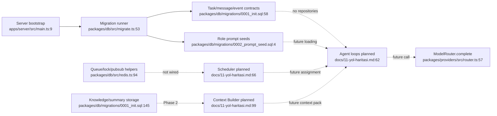

# Feature Inventory: Agent Communication

## Executive Finding

The repository has a strong communication substrate but no runtime inter-agent
communication yet. Phase 0 implemented schemas, Redis primitives, shared vocabulary,
provider execution, and role prompts. The message repository, inbox processing,
agent loops, scheduler, Context Builder, policy enforcement, and task/message APIs
remain planned work for Phase 1 and later.

## Approved Feature Boundaries

| Feature | Current entry points | Boundary and status |
|---|---|---|
| Durable contracts and trace | `packages/db/src/migrate.ts:53`, `packages/db/migrations/0001_init.sql:58` | Implemented schemas for tasks, messages, events, knowledge, and prompts; runtime repositories/writers absent |
| Message transport and agent loops | `packages/shared/src/constants.ts:19`, `docs/03-agent-sistemi.md:87`, `docs/03-agent-sistemi.md:149` | Message vocabulary and role prompts exist; inbox, reply handling, worker/verifier/PM loops are planned |
| Task orchestration and scheduling | `packages/db/src/redis.ts:94`, `docs/07-zamanlayici.md:19` | Queue/lock/pub-sub helpers exist; assignment, transitions, heartbeat, brakes, and recovery are planned |
| Memory and temporal context | `packages/db/migrations/0001_init.sql:130`, `docs/06-hafiza-ve-baglam.md:73` | Storage exists; Context Builder, retrieval, temporal filtering, summaries, and handoff are planned |
| Rule enforcement and auditing | `packages/db/migrations/0002_prompt_seed.sql:4`, `docs/05-executor.md:28`, `docs/09-kod-standartlari.md:19` | Prompt rules and verifier trust boundary exist; deterministic policy guards, rule snapshots, and communication audits are absent |
| Provider/model execution | `packages/providers/src/router.ts:57`, `packages/providers/src/usage.ts:8` | Implemented library for normalized calls, fallback, and usage; not wired to agent runtime |
| API/UI control and observability | `apps/server/src/main.ts:9`, `apps/server/src/health.controller.ts:5`, `apps/panel/src/App.tsx:3` | Only health paths exist; project/task/message APIs, WebSocket trace, and audit UI are planned |

## Cross-Cutting Operational Layer

`CLAUDE.md:3` and `docs/12-agent-devir-ve-hafiza.md:6` govern developer-agent
handoff between Codex and Claude. They are not part of the ww product runtime and
must not be mistaken for proof that product agents can communicate.

## Current Integration Map

## Discovery Gaps to Resolve

- `messages.content` is untyped free text with no schema version, reply/causation,
  dedupe, delivery state, deadline, or trust classification (`0001_init.sql:86`).
- Tasks have no first-class acceptance-criteria field or applied rule snapshot
  (`0001_init.sql:58`; prompt expectation at `0002_prompt_seed.sql:39`).
- There is no deterministic routing/authorization/policy guard or structured
  verifier verdict; prompt instructions are the only enforcement.
- There is no agent inbox notification/ack/replay path or monotonic event sequence
  generator, despite durable messages and `events.seq` existing in the schema.
- Recovery phase placement conflicted during discovery. Synthesis resolved it by
  aligning `docs/01-mimari.md` with the authoritative Phase 2 roadmap.
