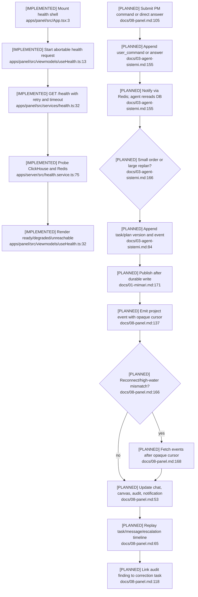

# API/UI Control and Observability

## Current State

Only `/health` and a health panel exist. Commands, direct answers, task/message
views, audit findings, WebSocket delivery, and replay are planned. The intended
durable-write → Redis notification → WebSocket → REST gap-fill path is coherent
but underspecified.

## Flow

## Contract Gaps

- Discovery found a global-sequence/project-filter conflict. Synthesis now defers
  the project-scoped replay cursor decision explicitly to Phase 3.
- WebSocket event names do not map one-to-one to persisted `EVENT_TYPES`, so raw
  REST replay may not reproduce live delivery.
- `publishEvent()` can publish without proving the durable append occurred first.
- Multiple questions in one session cannot be paired reliably without `reply_to`.
- No reconnect high-water mark, pagination, dedupe, out-of-order policy, or
  race-free subscribe/snapshot sequence is specified.
- Planned audit findings have no durable schema or correction-task linkage.
- Shared `WsEnvelope.event` is an unrestricted string and Redis JSON is cast
  without runtime validation (`packages/shared/src/types.ts:1-8`;
  `packages/db/src/redis.ts:152-180`).

## Required Decisions

Use an opaque per-project cursor, persist one canonical envelope for REST and WebSocket,
route publication through a single durable-first service, validate all boundaries,
and define snapshot + high-water mark + ordered replay semantics.

Confidence is **high** for current status and **medium** for planned runtime
behavior because the control-plane modules do not exist yet.
