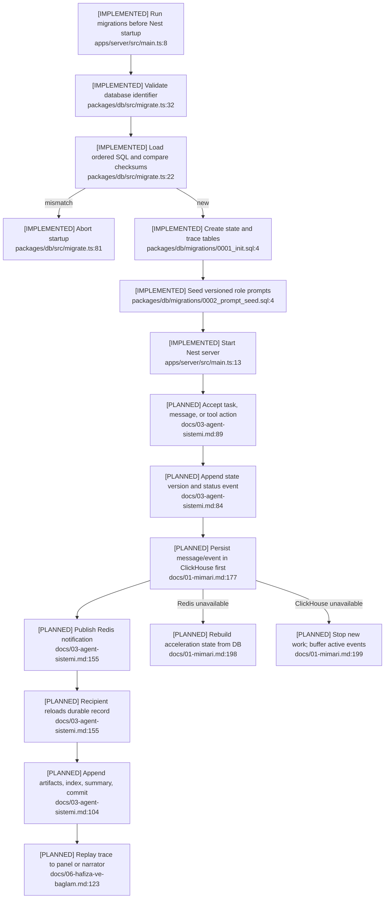

# Durable Contracts and Trace

## Current State

Phase 0 implements startup migrations, checksums, ClickHouse state/trace tables,
prompt seeds, latest-version reads, Redis primitives, and the API-usage sink. It does
not implement task, message, event, or artifact repositories; an event-sequence
allocator; or the ClickHouse-first/Redis-second runtime path.

## Flow

## Gaps and Failure Paths

- Migration statements are not transactional; the ledger is appended only after
  all statements complete (`packages/db/src/migrate.ts:83-86`).
- There is no outbox/retry contract for a crash after the ClickHouse append but
  before the Redis notification.
- `messages.content` and `events.payload` are unversioned free-form strings. They
  lack correlation, causation, idempotency, delivery, deadline, and provenance
  fields (`packages/db/migrations/0001_init.sql:86-114`).
- `events.seq` has no implemented monotonic allocator (`0001_init.sql:101-114`).
- Tasks do not persist acceptance criteria or the assignment-time prompt/rule
  snapshot required by the worker and verifier prompts (`0001_init.sql:58-84`;
  `0002_prompt_seed.sql:36-65`).

## Dependencies and Confidence

The flow depends on ClickHouse, Redis, future repositories, Context Builder, and
panel/narrator replay. Confidence is **high** for implemented status and **medium**
for delivery/recovery semantics because those contracts are not yet specified.
