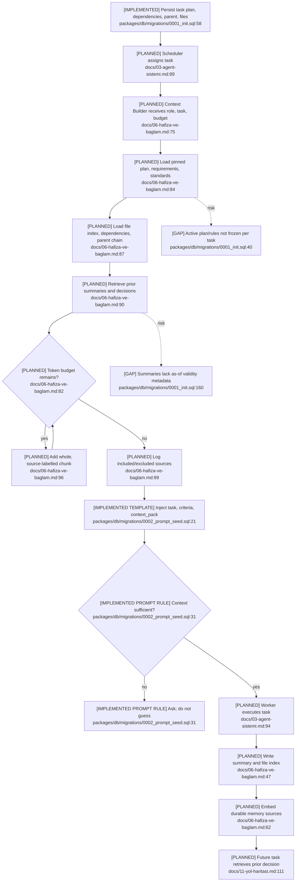

# Memory and Temporal Context

## Current State

Append-only history and versioned plans, tasks, knowledge, and prompts exist. The
Context Builder, summarization, embeddings, and narrator are planned for Phase 2.
There is no enforceable assignment-time snapshot, so later plans, rules, summaries,
or knowledge can contaminate a resumed or replayed earlier task.

## Flow

## Temporal Gaps

- Tasks lack `context_snapshot_id`, `assigned_at`, a knowledge cutoff, acceptance
  criteria, and rule/prompt/standard versions (`0001_init.sql:58-84`).
- Knowledge has current `active/superseded` state but no `known_at`, `valid_from`,
  or `valid_to`, so historical truth cannot be reconstructed (`0001_init.sql:145-158`).
- Context Builder is told to load the active plan even though a task is bound to a
  specific `plan_id`; replanning can leak into old work.
- Summaries lack covered time range/source versions; embeddings lack source revision
  validity. “Latest N” can therefore expose future facts to a replayed task.
- `agents.prompt_version` is mutable agent state, not an immutable task assignment
  record.

## Dependencies and Confidence

The planned flow writes decision events, summaries, file-index revisions,
embeddings, and knowledge. It depends on ClickHouse, scheduler, agents, executor,
and embedding providers. Confidence is **high** on schema gaps and **medium-high**
on planned behavior.
