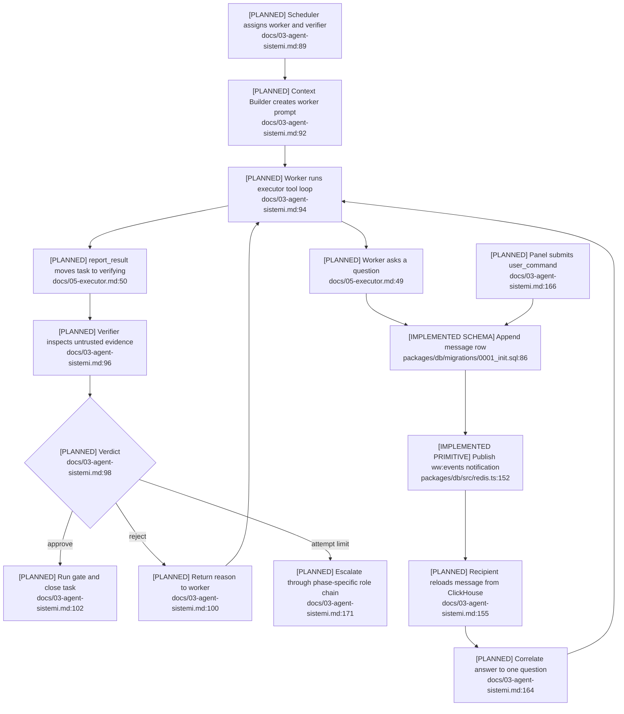

# Message Transport and Agent Loops

## Current State

Shared message kinds, sentinel identities, the append-only `messages` table,
generic Redis pub/sub, and role prompts exist. No `packages/agents`, message
service, durable inbox consumer, reply resolver, or PM/worker/verifier runtime
exists.

## Flow

## Gaps and Failure Paths

- `session_id` cannot unambiguously pair multiple concurrent questions and
  answers; `reply_to`, correlation, and causation identifiers are absent.
- There is no inbox cursor, delivery receipt, ACK/replay policy, dedupe key,
  deadline, or role-based authorization matrix.
- At-least-once task recovery can duplicate agent messages or side effects because
  message idempotency is undefined.
- `content` and verifier verdicts have no discriminated runtime schema. Redis
  subscribers parse JSON without protocol validation.
- Language, routing, and sender/recipient rules exist only in prompts.
- Documentation mentions `message.created`, but `EVENT_TYPES` has no matching
  vocabulary (`packages/shared/src/constants.ts:24-28`).

## Dependencies and Confidence

The planned path depends on ClickHouse, Redis, scheduler, Context Builder,
provider router, executor, server, and panel. Confidence is **high** about the
missing runtime and **medium-high** about intended semantics.
