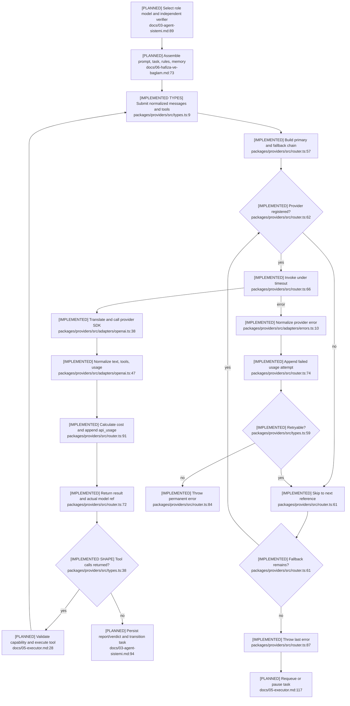

# Provider and Model Execution

## Current State

Normalized messages/tool calls, adapters, timeout, fallback, pricing, usage writes,
mock execution, and encrypted key storage are implemented. Role-model resolution,
prompt construction, tool loops, durable protocol messages, health-aware routing,
budget enforcement, and failure requeue are not wired.

## Flow

## Gaps and Risks

- In-memory `ChatMessage` and durable agent `messages` are separate domains with no
  mapper. Completion metadata lacks message/correlation/rule-snapshot identity.
- `role_models` is stored but never resolved; verifier/provider diversity is not
  enforced.
- `Promise.race` timeout does not cancel the paid SDK request.
- Usage persistence is on the success critical path; a DB error can hide a paid
  completion and cause duplicate execution.
- Arbitrary tool names/arguments need deterministic schema and role authorization;
  malformed OpenAI arguments currently normalize to `{}`.
- Prompt-injection protection is verifier-specific, and key redaction is not wired
  to future trace/event persistence.

## Dependencies and Confidence

The path depends on external provider APIs, ClickHouse usage storage, key storage,
and the future agents/executor/memory/scheduler packages. Confidence is **high** on
the implementation boundary and missing wiring.
