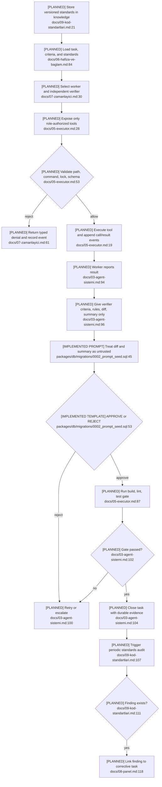

# Rule Enforcement and Auditing

## Current State

Versioned role prompts teach workspace, scope, test, question, reporting,
independence, and trust-boundary rules. Migration tests protect those prompt
markers. Runtime permission checks, transition guards, task-pinned rules, and
standards-auditor findings are not implemented.

## Flow

## Enforcement Gaps

- Prompt teaching is not a behavior guarantee. No deterministic role/tool/file
  permission matrix or central task-transition guard exists.
- Tasks do not pin acceptance criteria, prompt/rule/standard versions, or their
  hashes; retries and reassignments are not reproducible.
- Trust classification covers verifier diff/summary only, not inter-agent content,
  memory, tool results, task text, or standards.
- Verdicts and policy findings are untyped. No rule ID/version, severity, evidence,
  corrective task, resolution, or violation event is modeled.
- “Every task gets a verifier” and the verifier-free summarizer exception have no
  centralized precedence rule.
- Tests validate prompt text, not authorization, injection resistance, model
  independence, rule pinning, or finding-to-correction behavior.

## Dependencies and Confidence

Enforcement must be layered: Context Builder teaches the pinned rules; executor and
scheduler apply deterministic guards; verifier/auditor judge semantic compliance.
Confidence is **high**; runtime files for these planned components do not yet exist.
