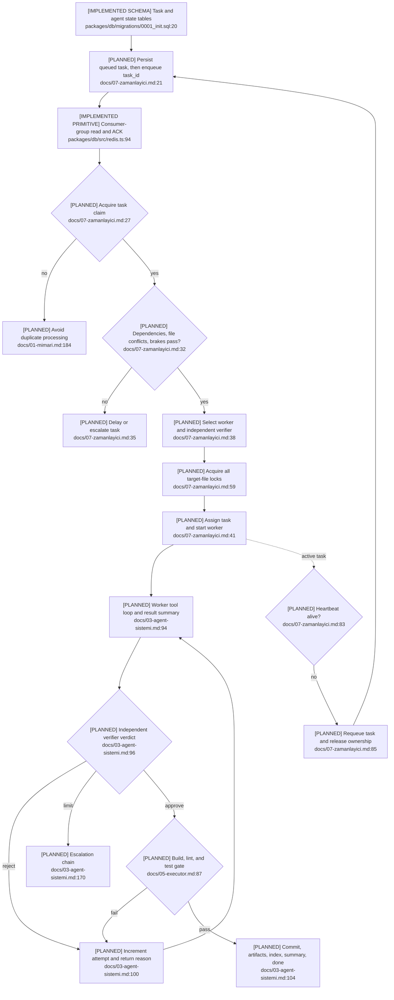

# Task Orchestration and Scheduling

## Current State

Task/agent tables, shared status constants, latest-state reads, Redis Stream and
lock primitives, provider fallback, and worker/verifier prompts are implemented.
The scheduler, FSM guard, dependency evaluator, heartbeat/recovery service,
executor, and agent loops are planned.

## Flow

## Gaps and Failure Paths

- Queue ACK timing and pending-entry reclaim are undefined; `XAUTOCLAIM` is absent.
- Claim renewal, heartbeat helpers, delayed requeue, and all-or-nothing file locks
  are not implemented.
- No central guard enforces allowed FSM transitions; `rejected` exists in constants
  while the lifecycle diagram routes rejection directly back to `working`.
- Recovery assumes destructive working-tree cleanup without a defined per-task
  worktree owner, risking unrelated work (`docs/07-zamanlayici.md:97-104`).
- Discovery found a recovery-phase conflict; synthesis corrected
  `docs/01-mimari.md` to the authoritative Phase 2 scope in
  `docs/11-yol-haritasi.md:95-113`.

## Dependencies and Confidence

Side effects span ClickHouse versions/events/messages, Redis Stream/locks/heartbeat,
provider calls, workspace changes, gates, and Git commits. Confidence is **high**
for current/planned boundaries and **medium** for ACK/recovery semantics.
