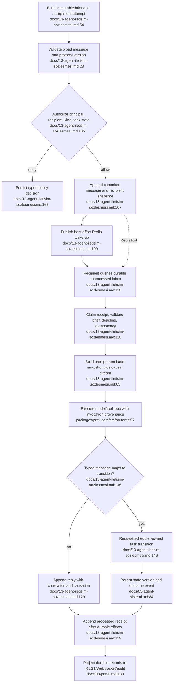

# Unified Proposal: Agent Communication Contract

## Decision

Adopt one versioned **Agent Communication Contract** before implementing Phase 1
agent loops. The repository already has the correct persistence and role concepts,
but not the runtime guarantees that make communication reliable, replayable, and
auditable.

This does **not** reopen Phase 0. Phase 0 delivered the substrate. The contract is
the first vertical slice of Phase 1 and prevents the scheduler, agents, executor,
memory, and UI from inventing incompatible rules.

## Architectural Invariants

1. ClickHouse is durable truth; Redis only wakes consumers.
2. Messages express intent or conversation; only the scheduler transition service
   changes task state; events describe outcomes already applied.
3. Every external or agent payload is untrusted data until runtime schema,
   authorization, and task-contract checks pass.
4. A task freezes one immutable `TaskBriefV1`; each execution/reassignment creates
   an immutable `AssignmentAttemptV1`. A changed plan/rule/base context creates a
   new brief version and explicit rebase; ownership change creates a typed handoff.
5. Delivery is at least once. Handlers invoke only effects protected by a durable
   `causationId + stableEffectId` ledger; unsupported non-idempotent effects escalate.
6. Redis loss cannot lose work. Restart polling replays durable, unprocessed inbox
   records.
7. Rules are enforced at three layers: deterministic guards, prompt teaching from
   the pinned snapshot, and independent semantic verification/audit.

## Canonical Flow



## Versioned Contracts

### `AgentMessageEnvelopeV1`

Own it in `@ww/shared` as a discriminated runtime schema, not only a TypeScript
interface.

```ts
type AgentMessageEnvelopeV1 = {
  protocolVersion: 1;
  messageId: string;
  projectId: string;
  sessionId: string;
  taskId?: string;
  taskBriefId?: string;
  assignmentAttemptId?: string;
  senderPrincipalId: string;
  recipient: PartyRef;
  kind: MessageKind;
  payload: MessagePayloadV1;
  replyToMessageId?: string;
  correlationId: string;
  causationId?: string;
  idempotencyKey: string;
  invocationId?: string;
  promptInputSnapshotId?: string;
  provenance: Provenance;
  priority: 'normal' | 'urgent';
  createdAt: string;
  deadlineAt?: string;
};
```

`MessagePayloadV1` must discriminate `question`, `answer`, `order`, `proposal`,
`objection`, `synthesis`, `report`, `verdict`, `escalation`, and `user_command`.
Broadcast is a recipient, not a message kind. Reports/verdicts carry
evidence references and stable rule references; they do not smuggle executable
instructions inside evidence text.

The sender role is never trusted from the envelope. `CommunicationService` derives
agents from runtime capability + current agent state, users from authenticated
server sessions + `USER_SENTINEL`, and allowlisted internal services from a new
`SYSTEM_SENTINEL`; `BROADCAST_SENTINEL` is recipient-only. It then stores a
validated principal/role/version snapshot. The database stores canonical `payloadJson` plus
`payloadVersion`; `content` is only a human-readable/legacy projection. Writers and
readers both validate `kind === payload.type`.

### `TaskBriefV1`

Seal at assignment and persist immutably:

- task/plan IDs and versions, goal, acceptance criteria, dependency snapshot;
- target files, allowed tools, budget, deadline;
- prompt, standard, and rule-set IDs/versions/hashes;
- `contextSnapshotId`, `baseContextCutoffAt`, and source references;
- `verificationMode: 'required' | 'exempt'` plus an explicit exemption rule.

Every provider invocation, report, verdict, transition request, and finding carries
`taskBriefId`. A replan never mutates an existing brief.

`AssignmentAttemptV1` separately pins worker/verifier, attempt number, lease,
start reason, and previous attempt. A retry or heartbeat reassignment creates a new
attempt while retaining the task brief. A `TaskHandoffV1` transfers only durable
artifacts/evidence, causal cursor, pending questions/receipts, workspace/commit
checkpoint, and lock-release outcome; the new owner reacquires locks.

The context has two clocks: `baseContextCutoffAt` freezes global plan/rules/memory,
while `taskCausalCursor` admits only later feedback causally linked to this brief
(verifier rejection, gate output, answer, escalation). This prevents future-state
leakage without hiding necessary retry feedback.

Phase 1 permits one active assignment attempt per task and defines
`TaskCausalCursorV1 = { assignmentAttemptId, handoffId?, ordinal }`. `ordinal` is
monotonic within an attempt. Every verifier/gate/answer/escalation append goes
through the scheduler-owned single logical writer `TaskCausalLog.append`, which
checks the current attempt and task lease. After restart it resumes at the latest
durable ordinal; a deterministic causal-entry/message ID maps retry to the existing
row. Handoff seals the ancestor cursor and the new attempt starts at ordinal zero.
Concurrent attempts and branch merge are rejected in Phase 1; a future frontier or
vector requires a protocol-version bump. This is separate from the Phase 3 project
UI cursor.

Each LLM call seals a `PromptInputSnapshotV1` containing its
`inputTaskCausalCursor`, brief/attempt IDs, and source hashes. Replay uses that exact
snapshot. Handoff grants the new attempt only the sealed ancestor cursor plus its
own later causal stream; parallel/future attempts remain invisible.

### `PolicyDecision` and `AuditFinding`

All deterministic guards return `{ ruleId, ruleVersion, allowed, reason,
evidenceRefs }`. Semantic checks add severity, finding status, and optional
corrective task ID. Stable rule IDs make decisions teachable in prompts and
auditable after execution.

## Runtime Ownership

### `packages/shared`

Own versioned schemas, enums, parsers, and compatibility tests. Unsupported protocol
versions fail closed.

### `packages/agents`

Expose one `CommunicationService` for send, inbox read, receipt, routing, and
message authorization. Executor tools and REST controllers are thin callers. A
worker cannot create a verifier verdict or impersonate another role.

The Phase 1 route matrix is explicit: user→PM `user_command`; user→pending asker
`answer`; worker→PM `question`; worker→assigned verifier/scheduler `report`;
verifier→assigned worker/scheduler `verdict`; PM/lead→scoped worker `order`.
Phase 4 inserts the group lead route. Handlers map `report`, `verdict`, and
`answer` to typed transition requests.

### `packages/scheduler`

Own `TaskTransitionService`, assignment, attempt counting, queue/lock consequences,
and recovery. Messages can request transitions but cannot directly mutate state.

### `packages/memory`

Own `TaskContextSnapshotBuilder` and as-of reads. It must load the task-pinned plan,
not the project's current active plan. Phase 1 freezes available sources; Phase 2
adds semantic retrieval and bitemporal knowledge (`knownAt`, `validFrom`,
`validTo`, supersession, summary coverage).

### `packages/executor` and `packages/providers`

Executor owns tool/path/command capability checks. Providers own normalized model
execution and record the actual fallback route. One `invocationId` joins source
message, task brief/attempt, prompt-input snapshot, API usage, tool events, and
response. `CompletionMeta` and `api_usage` persist these IDs and fallback attempt;
the result message stores the router's actual `usedRef`.

### Server and panel

Controllers validate DTOs and call domain services. UI consumes projections only.
Phase 3 makes REST and WebSocket share one validated durable event vocabulary and a
project-scoped cursor/high-water contract.

## Persistence Changes

Create a forward-only Phase 1 migration; never edit `0001_init.sql` or
`0002_prompt_seed.sql`.

- Extend durable messages with protocol/payload version, canonical `payload_json`,
  reply/correlation/causation, idempotency, task-brief/attempt, invocation, deadline,
  priority, authenticated-principal snapshot, and provenance fields.
- Add the shared `SYSTEM_SENTINEL` and fail closed for any unrecognized service
  principal; keep `BROADCAST_SENTINEL` recipient-only.
- Add immutable `task_briefs`, `assignment_attempts`, `prompt_input_snapshots`
  (input causal cursor, source-version manifest, prompt hash), and typed handoff records.
- Extend the latest task projection with current brief/attempt IDs. Add append-only
  `task_causal_entries(task_id, task_brief_id, assignment_attempt_id, handoff_id,
  ordinal, entry_id, source_type, source_id, causation_id, created_at)`, ordered by
  task/attempt/ordinal/entry. Under the task lease, its repository verifies the
  latest-task current attempt, returns the existing ordinal for deterministic
  `entry_id`, otherwise synchronously appends folded `max(ordinal)+1`; an uncertain
  insert is reconciled before another allocation, and ordinal collisions fail closed.
- Add append-only per-recipient `message_receipts`: `enqueued → claimed → processed`,
  with `retry_scheduled`, lease expiry/reclaim, backoff, and terminal `failed` +
  escalation. Broadcast recipient sets are snapshotted at send.
- Add an effect ledger keyed by `causation_id + stable_effect_id` (or deterministic
  operation ordinal); `effect_kind` is metadata only.
- Extend provider metadata and `api_usage` with invocation, brief, assignment,
  prompt-input snapshot, and fallback-attempt fields.
- Seed and activate `role.worker.coding` v2 (questions go directly to PM) and
  `role.pm` v2 (accept direct worker questions) in that forward migration. Marker
  tests protect this Phase 1 route; Phase 4 introduces group-lead routing through
  another prompt/protocol version.
- Add versioned `audit_findings` with rule, severity, evidence, corrective task, and
  resolution.
- Extend `EVENT_TYPES` with typed communication/brief/policy/handoff timeline
  events. Canonical message and receipt tables remain the delivery truth.

Phase 3—not the Phase 1 migration—defines the project-scoped journal cursor and
the canonical durable-record-to-live-event projection.

ClickHouse and Redis cannot form one transaction. Correctness therefore comes from
durable-first ordering, deterministic IDs, idempotent retries, inbox polling, and a
reconciler—not an exactly-once claim.

## Rule Teaching and Enforcement

| Layer | Responsibility | Example |
|---|---|---|
| Deterministic | Schema, route, FSM, capability, deadline | Worker cannot emit `verdict` |
| Instructional | Render pinned rules and reasons into the prompt | “Rule COMM-004 allows questions only to lead/PM” |
| Semantic | Verifier/auditor evaluates evidence and intent | Report omits required decision record |

All inter-agent content, tool results, memory chunks, diffs, and user text are
labelled by provenance and treated as data. None may override system policy,
`TaskBriefV1`, or its pinned rule set.

## Acceptance Test Matrix

- Reject unknown protocol versions, payload shapes, forged sender roles, forbidden
  routes, expired messages, and illegal task transitions.
- Deduplicate repeated sends and repeated consumer processing by stable keys.
- Pair an answer to exactly one question through `replyToMessageId`; reject a
  mismatched task/session.
- Recover and process a durable message when Redis notification is absent.
- Replay pending messages after a crash between effect and receipt; prove the
  durable effect ledger prevents a duplicate replay-safe effect and unsupported
  non-idempotent effects escalate.
- Prove an old task cannot see a later plan, rule, prompt, summary, or knowledge
  record, while still seeing its causal verifier/gate/answer stream; prove an
  explicit rebase creates a new brief.
- Prove reassignment creates a new attempt and typed handoff without transferring
  the old lease or file locks.
- Prove task-causal ordinals continue after restart, duplicate appends reuse the
  durable entry, stale/parallel attempts fail closed, and handoff seals the exact
  ancestor cursor before the new attempt begins at zero. Inject an uncertain insert
  outcome and prove reconciliation occurs before the next ordinal is allocated.
- Reject prompt-injection attempts embedded in messages, diffs, memory, or tool
  results.
- Prove worker/verifier independence and forged-verdict rejection.
- Prove provider fallback records the actual model and shared `invocationId`.
- Run the Phase 1 MockProvider scenario through question, answer, rejection,
  correction, gate, commit, receipts, and durable audit trail.

## Rollout Order

1. Shared schemas, migration, repositories, and pure guard tests.
2. Communication service, inbox receipts, polling/recovery, and question/answer.
3. Task brief sealing and scheduler-owned transitions.
4. Worker/verifier loops, executor/provider attribution, and semantic findings.
5. REST projections and end-to-end MockProvider acceptance gate.
6. Phase 2 bitemporal retrieval; Phase 3 WebSocket replay; Phase 4 periodic
   `communication_audit` profile on the existing `standards_auditor` role.

## Deliberate Non-Goals

- No exactly-once guarantee across ClickHouse and Redis.
- No universal policy engine, service registry, or dynamic plugin framework.
- No natural-language parser for permissions; rules have stable IDs and code-owned
  predicates.
- No full semantic memory or panel implementation pulled into Phase 1.
