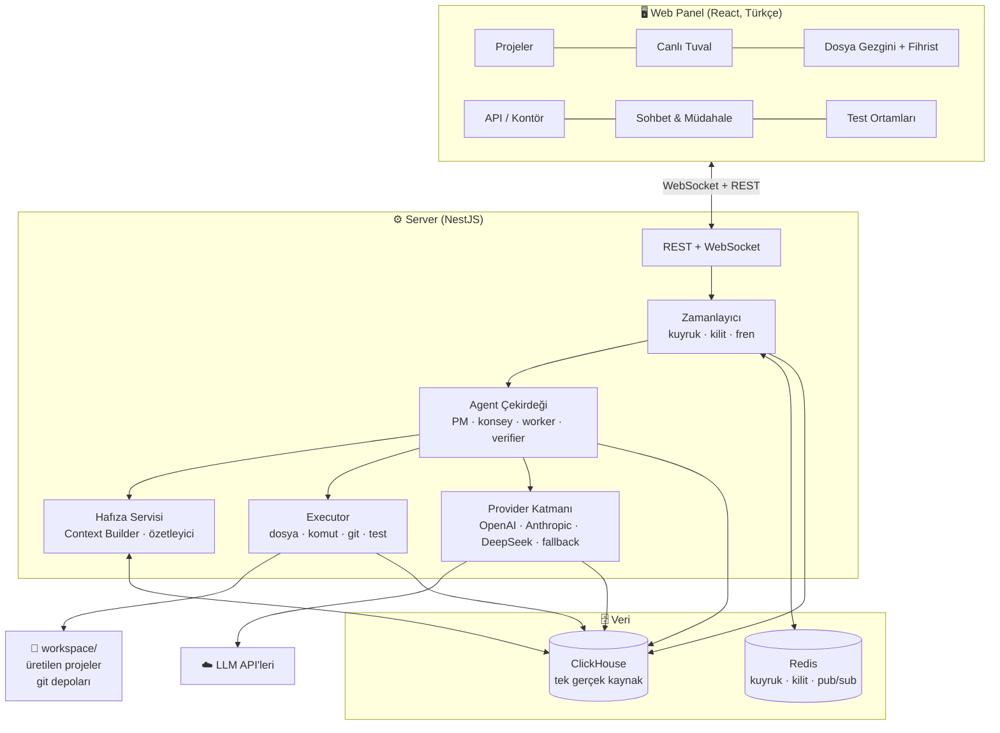

# 00 — Genel Bakış

> ww platformunun vizyonu, temel kavramları ve üst düzey mimarisi.
> Diğer dokümanlar: [Mimari](01-mimari.md) · [Şema](02-clickhouse-semasi.md) · [Agent Sistemi](03-agent-sistemi.md) · [Yol Haritası](11-yol-haritasi.md)

## İçindekiler

1. [Vizyon](#vizyon)
2. [Temel İlkeler](#temel-ilkeler)
3. [Sözlük](#sözlük)
4. [Üst Düzey Mimari](#üst-düzey-mimari)
5. [Karar Kaydı](#karar-kaydı)

---

## Vizyon

ww, kullanıcının "şöyle bir uygulama istiyorum" demesiyle başlayan ve çok sayıda
LLM agent'ının **birbirini denetleyerek** üretim kalitesinde yazılım çıkardığı bir
platformdur. İnsan; yönetici, karar verici ve gözlemcidir. Sistem; planlayan,
tartışan, yazan, denetleyen, test eden ve **her adımını veritabanına işleyen**
bir yazılım ekibi gibi davranır.

Ayırt edici özellikler:

- **DB-merkezli işleyiş**: Agent'lar birbiriyle doğrudan değil, ClickHouse + Redis
  üzerinden konuşur. Sistemin tamamı DB'den yeniden kurulabilir; "kurumsal hafıza"
  sistemin kendisidir.
- **Çift kuralı**: Hiçbir iş tek agent'la kapanmaz. Her emir çıktığında bir agent'a
  *yapma*, bir agent'a *denetleme* görevi verilir.
- **Konsey planlaması**: Plan tek modelin fikri değildir; 3-4 farklı model tartışır,
  itiraz eder, sentezler.
- **Basite kaçma yok**: MVVM ana şablondur, kod standartları yazılıdır ve bunları
  sabit denetleyen agent'lar vardır.
- **Tam gözlemlenebilirlik**: Canlı tuval, fihristli dosya gezgini, kontör paneli —
  kim kime iş verdi, hangi dosya neden değişti, kaç para harcandı; hepsi görünür.

## Temel İlkeler

1. **Tek gerçek kaynak ClickHouse'tur.** Redis yalnızca hız tamponudur; silinse bile
   sistem ClickHouse'tan kurtarılır ([Mimari → Kurtarma](01-mimari.md#çökme-kurtarma)).
2. **Append-önce**: `events` ve `messages` append-only'dir; hiçbir kayıt silinmez,
   durum değişimleri yeni sürüm kaydıyla yazılır.
3. **Her işin izi vardır**: görev ↔ mesajlar ↔ tool olayları ↔ artefaktlar ↔ commit
   hash zinciri her zaman kurulabilir. "Bunu nasıl yaptın?" sorusu bir SQL zinciridir.
4. **Model bağımsızlığı**: Tüm sağlayıcılar tek arayüz arkasındadır; bir API düşerse
   işler fallback zincirine akar.
5. **İnsan her an müdahale edebilir**: emir yollama, plana itiraz, soru cevaplama —
   hepsi `messages` üzerinden PM'e düşer ve normal akışın parçasıdır.
6. **Güvenli sandbox**: Agent'lar yalnızca kendi proje workspace'inde çalışır,
   komutlar beyaz listelidir.

## Sözlük

| Terim | Anlamı |
|---|---|
| **Agent** | Belirli bir rol + sistem promptu + model ile çalışan LLM çalışanı. Kaydı `agents` tablosundadır. |
| **PM (Proje Yöneticisi)** | Proje başına bir adet; planı sahiplenir, soruları cevaplar, tırmandırmaların son durağıdır (kullanıcıdan önce). |
| **Konsey** | Plan oluşturmak/revize etmek için 3-4 farklı modelden kurulan tartışma oturumu. |
| **Worker** | Görevi fiilen yapan agent. |
| **Verifier** | Aynı görevi denetleyen agent; mümkünse worker'dan farklı modelden. |
| **Grup** | Aynı uzmanlık alanındaki agent'ların takımı (tasarım, analiz, db, yazılım, araştırma, akıl-yürütme, ui-kontrol, mvvm-kontrol, db-yazım-kontrol). |
| **Grup lideri** | Grubun sorularını toplayan, tırmandırmanın ilk basamağı olan agent. |
| **Profesör** | Derin akıl yürütme danışmanı; zor problemlerde ve tırmandırmalarda görüş verir. |
| **Yaratıcı** | Tasarım/fikir üreten agent (UI konsepti, isimlendirme, UX akışları). |
| **Klon** | Meşgul bir agent'ın aynı rol/prompt/bağlamla açılmış kopyası (`agents.clone_of`). |
| **Delegasyon** | Bir agent'ın başka bir göreve alt görev açması; alt görev de otomatik worker+verifier alır. |
| **Fihrist** | Dosya başına tutulan bağlam kaydı (`file_index`): özet, ilişkili işler/kararlar, değişim geçmişi. |
| **Kontör** | API kullanım bütçesi; `api_usage` kayıtlarından hesaplanan maliyet ve limitler. |
| **Tırmandırma** | Çözülemeyen sorunun yukarı taşınması: grup lideri → profesör → PM → kullanıcı. |
| **Ping-pong freni** | Worker↔verifier ret döngüsünün deneme sınırı (varsayılan 3). |
| **Çalıştırma/test kapısı** | İş "onaylandı" olmadan önce derleme + lint + test zorunluluğu. |
| **Context Builder** | Her LLM çağrısından önce ilgili bağlamı DB'den derleyip prompt'a koyan servis. |
| **Anlatıcı** | "Bunu nasıl yaptın?" sorularını DB'deki iz zincirinden cevaplayan agent. |
| **Workspace** | Üretilen projenin git deposu olan klasörü (`workspace/<proje>`). |

## Üst Düzey Mimari

Akışın tamamı için: [01 — Mimari → Uçtan Uca Yaşam Döngüsü](01-mimari.md#uçtan-uca-yaşam-döngüsü).

## Karar Kaydı

| # | Karar | Seçim | Gerekçe |
|---|---|---|---|
| K1 | Platform dili | TypeScript monorepo | Tek dil; tüm LLM SDK'ları mevcut; WebSocket'li gerçek zamanlı panel için doğal; ClickHouse client olgun |
| K2 | Çalışma ortamı | Lokal, tek kullanıcı, Docker Compose | En hızlı başlangıç; maliyet yok; mimari sunucuya taşınabilir tutulur |
| K3 | Hedef proje türleri | Web + Mobil (Flutter) + Backend API | Kullanıcı üçünü de istiyor; MVVM üçünde de uygulanabilir |
| K4 | Executor | Kendi tool-use katmanımız | Tam kontrol; her adım DB'ye loglanır; model bağımsız |
| K5 | DB | ClickHouse tek gerçek kaynak + Redis tampon | ClickHouse analitik/append yükünde mükemmel; anlık kuyruk/kilit için Redis; kalıcı her şey CH'de |
| K6 | Panel dili | Türkçe (agent içi İngilizce) | Kullanıcı Türkçe istiyor; modeller İngilizce'de daha tutarlı |
| K7 | Üretilen projelerde git | Otomatik, iş başına commit | Geri alma, diff görme, `tasks.commit_hash` ↔ iz sürme |
| K8 | Ana şablon | MVVM (+ backend'de Controller→Service→Repository) | Kullanıcının kesin isteği; denetçi agent'larla zorlanır |
| K9 | API anahtarları | DB'ye yazılmaz; lokal şifreli dosya | Güvenlik; DB yedekleri anahtar sızdırmaz |
| K10 | Hafıza | 3 katman: ham → özet → embedding/arama | Bağlam penceresi sınırlı; "asla unutmama" ancak geri getirme ile ölçeklenir |
