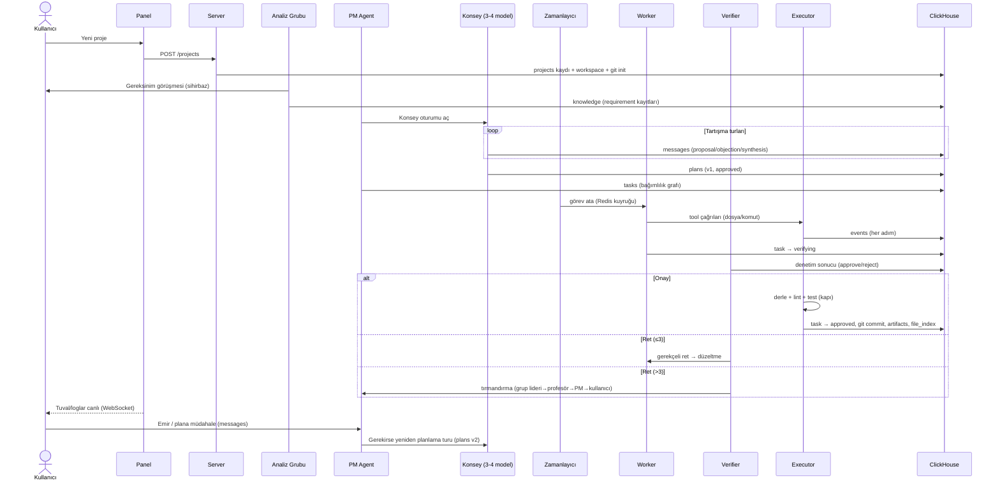

# 01 — Mimari

> Monorepo yapısı, servisler, Docker topolojisi, uçtan uca veri akışı,
> ClickHouse↔Redis görev ayrımı ve çökme kurtarma kuralları.
> İlgili: [Genel Bakış](00-genel-bakis.md) · [Şema](02-clickhouse-semasi.md) · [Zamanlayıcı](07-zamanlayici.md)

## İçindekiler

1. [Monorepo Yapısı](#monorepo-yapısı)
2. [Servisler ve Sorumluluklar](#servisler-ve-sorumluluklar)
3. [Docker Compose Topolojisi](#docker-compose-topolojisi)
4. [Uçtan Uca Yaşam Döngüsü](#uçtan-uca-yaşam-döngüsü)
5. [ClickHouse ↔ Redis Görev Ayrımı](#clickhouse--redis-görev-ayrımı)
6. [Tutarlılık Kuralları](#tutarlılık-kuralları)
7. [Çökme Kurtarma](#çökme-kurtarma)

---

## Monorepo Yapısı

pnpm workspace + Turborepo. Node ≥ 22, TypeScript strict.

```
ww/
├── apps/
│   ├── server/              # NestJS uygulaması
│   │   └── src/
│   │       ├── modules/
│   │       │   ├── projects/     # proje CRUD + yaşam döngüsü
│   │       │   ├── orchestration/# zamanlayıcı entegrasyonu, görev API'si
│   │       │   ├── agents/       # agent yönetimi API'si
│   │       │   ├── providers/    # API sağlayıcı yönetimi + kontör
│   │       │   ├── files/        # dosya gezgini + fihrist API'si
│   │       │   ├── chat/         # kullanıcı↔PM mesajlaşma
│   │       │   ├── canvas/       # tuval beslemesi (WebSocket)
│   │       │   └── testenv/      # önizleme / emülatör / API konsolu
│   │       └── gateway/          # WebSocket gateway (tek kanal, olay zarfı)
│   └── panel/               # React + Vite + TypeScript (Türkçe UI)
│       └── src/
│           ├── pages/            # projeler, tuval, dosyalar, api, sohbet, denetim, test
│           ├── components/
│           ├── stores/           # zustand: canlı durum, WebSocket aboneliği
│           └── lib/ws.ts         # olay zarfı çözücü
├── packages/
│   ├── shared/              # Tipler: Task, AgentInfo, WsEvent, enums (tek kaynak!)
│   ├── db/                  # ClickHouse client + migration + sorgu katmanı; Redis yardımcıları
│   ├── providers/           # LLM adaptörleri + fallback + kontör ölçümü
│   ├── agents/              # roller, prompt yükleyici, konsey, worker/verifier döngüleri
│   ├── scheduler/           # kuyruk tüketici, kilitler, frenler, tırmandırma, kurtarma
│   ├── memory/              # Context Builder, özetleyici, embedding, anlatıcı
│   └── executor/            # tool tanımları, sandbox, git, çalıştırma/test kapısı
├── docker-compose.yml
├── docs/
└── workspace/               # üretilen projeler (her klasör bir git deposu)
```

**Bağımlılık yönü** (döngü yasak):

```
shared ← db ← {providers, memory, executor} ← agents ← scheduler ← apps/server
```

## Servisler ve Sorumluluklar

| Birim | Ne yapar | Ne YAPMAZ |
|---|---|---|
| `apps/server` | HTTP/WS uçları, modüllerin kablolanması, yaşam döngüsü | İş mantığı barındırmaz; paketlere delege eder |
| `packages/scheduler` | Görev kuyruğu tüketimi, eşzamanlılık, kilitler, frenler, heartbeat, kurtarma | LLM çağırmaz; agent'ları tetikler |
| `packages/agents` | Agent döngüleri (PM, konsey, worker, verifier, denetçi...), mesaj protokolü | Doğrudan dosya yazmaz; executor kullanır |
| `packages/memory` | Context Builder, özetleyici, embedding üretimi, "nasıl yaptın" sorguları | Görev durumu değiştirmez |
| `packages/executor` | Tool-use: dosya/komut/git/arama/test; sandbox sınırları | Hangi görevin çalışacağına karar vermez |
| `packages/providers` | LLM API çağrıları, tool formatı normalizasyonu, fallback, `api_usage` yazımı | Prompt kurmaz (Context Builder kurar) |
| `packages/db` | Şema, migration, tip güvenli sorgular, Redis yardımcıları | İş kuralı içermez |
| `apps/panel` | Görselleştirme + kullanıcı girdisi | Karar vermez; her şey server üzerinden |

## Docker Compose Topolojisi

```yaml
# docker-compose.yml (özet)
services:
  clickhouse:
    image: clickhouse/clickhouse-server:24.8   # vektör arama destekli sürüm
    ports: ["8123:8123", "9000:9000"]
    volumes: ["ch-data:/var/lib/clickhouse"]
  redis:
    image: redis:7-alpine
    ports: ["6379:6379"]
    command: ["redis-server", "--appendonly", "yes"]
  server:
    build: apps/server
    depends_on: [clickhouse, redis]
    ports: ["4000:4000"]                        # REST + WS
    volumes:
      - ./workspace:/workspace                  # üretilen projeler
      - ./secrets:/secrets:ro                   # şifreli API anahtarları
  panel:
    build: apps/panel
    ports: ["3000:80"]
```

Notlar:

- **Geliştirmede** server ve panel host'ta `pnpm dev` ile çalışır; yalnızca
  ClickHouse + Redis container'dadır. Compose'un tam hali "kapalı kutu" çalıştırmadır.
- Android emülatör container'a girmez; host'taki AVD kullanılır
  ([Test Ortamları](10-test-ortamlari.md)).
- `workspace/` bilinçli olarak bind-mount'tur: kullanıcı üretilen projeleri kendi
  editörüyle de açabilir.

## Uçtan Uca Yaşam Döngüsü



Ayrıntılar: görev durum makinesi [03 — Agent Sistemi](03-agent-sistemi.md#görev-durum-makinesi),
kuyruk/fren mekaniği [07 — Zamanlayıcı](07-zamanlayici.md).

## ClickHouse ↔ Redis Görev Ayrımı

| Veri | Yeri | Neden |
|---|---|---|
| Görev kayıtları, durum geçmişi | ClickHouse (`tasks`) | Kalıcı, sorgulanabilir, iz sürülebilir |
| Anlık iş kuyruğu | Redis Stream (`ww:queue:<project_id>`) | Düşük gecikmeli atama, consumer group semantiği |
| Agent heartbeat | Redis (`ww:hb:<agent_id>`, TTL 30 sn) | Anlık canlılık; kalıcı değeri yok |
| Dosya kilitleri | Redis (`ww:lock:file:<project_id>:<hash>`) | Atomik SETNX + TTL; kalıcı değeri yok |
| Konuşmalar, konsey turları | ClickHouse (`messages`) | Kalıcı hafıza |
| Tool olayları, API çağrı logları | ClickHouse (`events`, `api_usage`) | Append-only analitik yük — ClickHouse'un ana gücü |
| Panel canlı beslemesi | Redis pub/sub (`ww:events`) → WebSocket | Fan-out; kalıcı kopya zaten `events`'te |
| Fihrist, bilgi, özetler, embeddingler | ClickHouse | Hafıza piramidi ([06](06-hafiza-ve-baglam.md)) |

**Altın kural:** Redis'te yaşayan hiçbir bilgi *yalnızca* Redis'te yaşamaz. Kuyruğa
yazılan her görev önce `tasks`'a yazılır; pub/sub'a basılan her olay önce `events`'e
yazılır. Redis kaybı = yalnızca hız kaybı, veri kaybı değil.

## Tutarlılık Kuralları

1. **Yazım sırası**: önce ClickHouse (kalıcı gerçek), sonra Redis (tampon/yayın).
   Panel bir olayı WebSocket'ten kaçırırsa REST ile `events`'ten tamamlar
   (Faz 3'te tanımlanacak opaque, proje kapsamlı cursor/high-water ile). Faz 0
   `events.seq` alanı public istemci cursor sözleşmesi değildir.
2. **Durum güncellemeleri**: `tasks` ve `agents` ReplacingMergeTree'dir; güncelleme =
   artan `version` (server'da monoton sayaç: `toUnixTimestamp64Milli(now64())`) ile
   yeni satır. Okumalar her zaman `FINAL` yerine `ORDER BY version DESC LIMIT 1 BY id`
   deseniyle yapılır (sorgu katmanı bunu kapsüller).
3. **İdempotent tüketici**: Zamanlayıcı bir görevi işlemeye başlarken Redis'te
   `ww:task:<id>:claim` kilidi alır; aynı görev iki kez işlense bile ikinci tüketici
   kilidi alamaz ve bırakır.
4. **Commit disiplini**: Dosya yazımları görev bitene dek working tree'de bekler;
   commit yalnızca çalıştırma/test kapısı geçilince atılır ve hash `tasks.commit_hash`'e
   yazılır. Yarım iş asla commit'lenmez.

## Çökme Kurtarma

Senaryolar ve davranış:

| Senaryo | Kurtarma |
|---|---|
| **Server çöktü / yeniden başladı** | Açılışta `RecoveryService`: (1) `tasks`'tan durumu `working/verifying/testing` olan görevleri bulur; heartbeat'i olmayanları `queued`'a düşürür (yeni sürüm satırı + `attempt` korunur). (2) Redis kuyruklarını `tasks WHERE status='queued'` ile yeniden doldurur (claim kilidi boşta olanlar). (3) Working tree'de commit'lenmemiş değişiklik varsa `git checkout .` ile temizler (yarım iş kuralı). *(2026-08-18'de uygulandı: HİÇBİR üretim kodu bunu yapmıyordu, yarım dosyalar diskte kalıyor ve sonraki deneme kirli ağaçtan başlıyordu. Temizlik YALNIZCA gerçekten görev kurtarılan projede koşar — çalışan bir sistemin ağacını silmek süren işi silmek olurdu. `.ww-trash/` korunur ve `-x` kullanılmaz: kurtarma, kurtardığından fazlasını bozmamalı.)* |
| **Redis kaybı (flush/çökme)** | Aynı `RecoveryService` akışı; kuyruk, kilit ve heartbeat'ler DB'den yeniden kurulur. Veri kaybı yoktur. |
| **ClickHouse geçici kapalı** | Server yazamıyorsa görev başlatmaz (fail-safe duraklatma); devam eden tool çağrıları lokal tamponda (disk üzerinde JSONL) bekletilir, bağlantı dönünce `events`'e boşaltılır. |
| **LLM API kesintisi** | Provider katmanı fallback zincirine geçer ([04](04-model-katmani.md#fallback)); hiçbir sağlayıcı yoksa görev `queued`'da bekler, panelde uyarı. |
| **Görev asılı kaldı** | Heartbeat TTL (30 sn) dolunca zamanlayıcı görevi geri alır; `attempt` artar; `max_attempts` aşılırsa tırmandırma. |

Kurtarma testi, mock provider ile entegrasyon test setinin parçasıdır
([11 — Yol Haritası, Faz 2](11-yol-haritasi.md#faz-2)).
