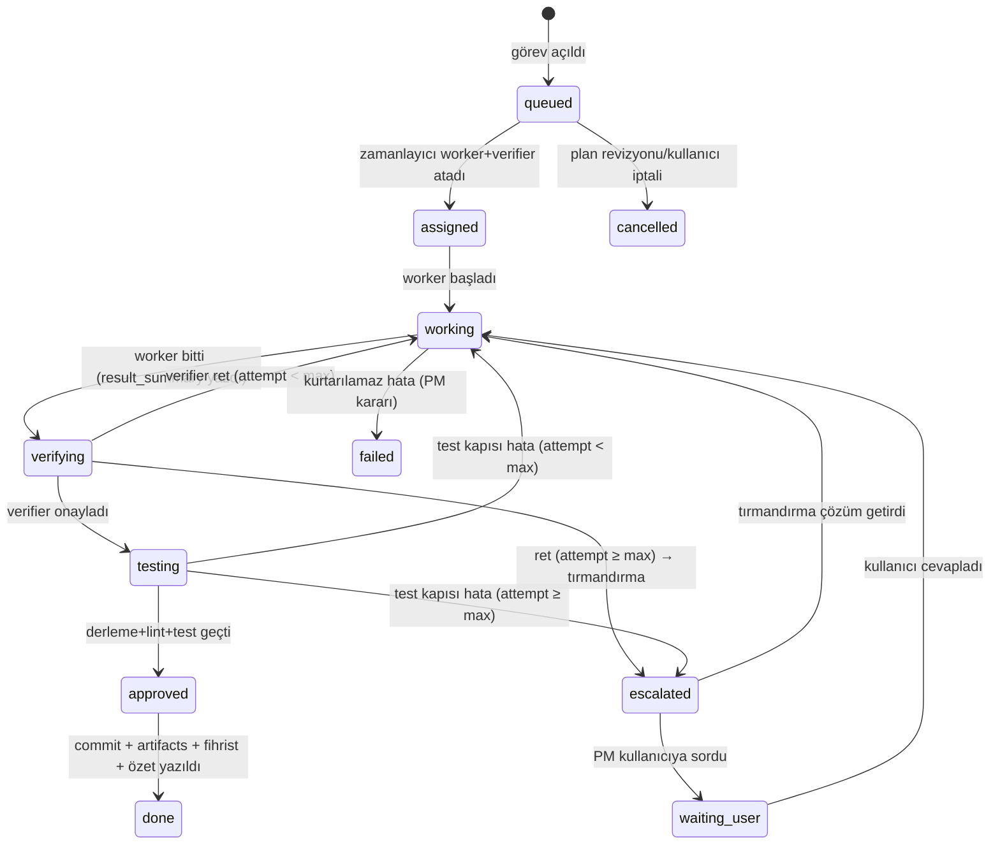

# 03 — Agent Sistemi

> Roller, gruplar, konsey protokolü, worker+verifier yaşam döngüsü, delegasyon,
> klonlama, iletişim protokolü ve tırmandırma zinciri.
> İlgili: [Şema](02-clickhouse-semasi.md) · [Zamanlayıcı](07-zamanlayici.md) · [Hafıza](06-hafiza-ve-baglam.md)

## İçindekiler

1. [Roller](#roller)
2. [Gruplar](#gruplar)
3. [Görev Durum Makinesi](#görev-durum-makinesi)
4. [Worker + Verifier Döngüsü](#worker--verifier-döngüsü)
5. [Konsey Protokolü](#konsey-protokolü)
6. [Delegasyon](#delegasyon)
7. [Klonlama](#klonlama)
8. [İletişim Protokolü](#iletişim-protokolü)
9. [Tırmandırma Zinciri](#tırmandırma-zinciri)
10. [Sistem Promptu Şablonları](#sistem-promptu-şablonları)

---

## Roller

Tüm roller `agents.role` değerleriyle birebir eşleşir; sistem promptları `prompts`
tablosunda sürümlüdür ve panelden düzenlenebilir.

| Rol | Görev | Varsayılan model gücü |
|---|---|---|
| `pm` | Projeyi yönetir; planı sahiplenir, görev dağılımını onaylar, soruların son iç durağıdır, kullanıcıyla konuşur | Güçlü |
| `council_member` | Konsey tartışmasında öneri/itiraz/sentez üretir; her üye **farklı sağlayıcıdan** | Güçlü |
| `group_lead` | Grubunun işlerini izler, grup içi soruları cevaplar, tırmandırma 1. basamak | Orta-güçlü |
| `interviewer` | Proje başında kullanıcıyla gereksinim görüşmesi yapar (analiz grubu) | Güçlü |
| `worker` | Görevi fiilen yapar (kod, tasarım, şema, araştırma…) | Orta |
| `verifier` | Worker'ın işini bağımsız denetler; **worker'dan farklı model** tercih edilir | Orta |
| `standards_auditor` | MVVM / kod standardı / UI-dostu / DB-yazım denetimlerini tetiklerle yürütür | Orta |
| `researcher` | Web arama + sayfa getirme araçlarıyla araştırır, bulgularını `knowledge`'a yazar | Orta |
| `professor` | Derin akıl yürütme danışmanı; zor problem ve tırmandırmalarda görüş yazar | En güçlü |
| `creator` | Yaratıcı üretim: UI konsepti, UX akışı, adlandırma, fikir | Güçlü |
| `summarizer` | Görev/faz/konsey özetlerini yazar, fihrist günceller | Ucuz |
| `narrator` | "Bunu nasıl yaptın?" sorularını iz zincirinden anlatır | Orta |

## Gruplar

`agents.group` değerleri ve sorumluluk alanları:

| Grup | Kapsam | Denetlediği standartlar |
|---|---|---|
| `management` | PM, konsey, profesörler | — |
| `analysis` | Gereksinim toplama, kabul kriterleri, senaryo yazımı | Gereksinim izlenebilirliği |
| `design` | UI/UX tasarımı, ekran akışları, tema | Tasarım tutarlılığı |
| `db` | Üretilen projenin veri modeli, şema, migration | Şema adlandırma kuralları |
| `coding` | Kod yazımı (view/viewmodel/model/servis/controller) | MVVM + kod standardı |
| `research` | Kütüphane/teknoloji araştırması, örnek toplama | Kaynak gösterme |
| `reasoning` | Profesörler; mimari kararlar, zor hatalar | — |
| `ui_audit` | UI-dostu kontrolü: erişilebilirlik, tutarlılık, kullanılabilirlik | UI kontrol listesi |
| `mvvm_audit` | Katman ihlali avı: View'da iş mantığı, Model'de UI vb. | MVVM kontrol listesi |
| `db_write_audit` | "Veritabanına ne, nasıl, nereye yazıldı; doğru mu yazıldı" denetimi — hem üretilen projenin DB kodu, hem ww kayıtlarının tamlığı (fihrist/artefakt eksiği) | DB-yazım kontrol listesi |

Denetçi grupların kontrol listeleri: [09 — Kod Standartları](09-kod-standartlari.md#denetçi-kontrol-listeleri).

## Görev Durum Makinesi



Her geçiş: `tasks`'a yeni sürüm satırı + `events`'e `status_change` olayı +
Redis pub/sub yayını (panel canlı görür).

## Worker + Verifier Döngüsü

1. **Atama**: Zamanlayıcı görevi kuyruktan alır; uygun `worker` ve `verifier` seçer
   (grup + `role_models` eşlemesi; verifier'a mümkünse worker'dan farklı sağlayıcı).
   Uygun agent yoksa klonlama devreye girer.
2. **Bağlam**: Context Builder worker promptunu kurar
   ([06 — Hafıza](06-hafiza-ve-baglam.md#context-builder)).
3. **Çalışma**: Worker tool döngüsünde çalışır (executor araçları); her adım `events`'e.
   Bitince `result_summary` yazar → `verifying`.
4. **Denetim**: Verifier'a *worker'ın sohbet geçmişi verilmez* — bağımsızlık için
   yalnızca: görev tanımı + kabul kriterleri + değişen dosyaların diff'i + `result_summary`
   + ilgili standartlar verilir. Verifier `verdict` mesajı yazar:
   `approve` veya `reject` + madde madde gerekçe.
5. **Ret döngüsü**: Ret gerekçesi worker'a yeni turda verilir; `attempt++`.
   3 denemede çözülmezse tırmandırma.
6. **Test kapısı**: Onay sonrası executor derleme+lint+test koşar
   ([05 — Executor](05-executor.md#çalıştırmatest-kapısı)). Hata çıktısı worker'a döner.
7. **Kapanış**: `approved` → git commit → `artifacts` + `file_index` güncelle →
   özetleyici görev özetini `summaries`'e yazar → `done`.

## Konsey Protokolü

Amaç: planın tek modelin önyargısıyla değil, çok modelin çatışmasıyla oluşması.

- **Kadro**: 3-4 `council_member`, her biri farklı sağlayıcıdan (ör. Claude + GPT +
  DeepSeek); PM oturum başkanıdır, oy kullanmaz, sentezi yönetir.
- **Tur yapısı** (hepsi `messages`'a `session_id` ile yazılır):
  1. **Tur 1 — Öneri**: Her üye bağımsız plan taslağı yazar (`proposal`).
     Taslak şunları içermek zorundadır: iş kırılımı, agent kadrosu (kaç worker,
     hangi gruplar), senaryolar, riskler, kabul kriterleri.
  2. **Tur 2 — İtiraz**: Her üye diğer taslakları eleştirir (`objection`);
     "katılıyorum" yasak, en az 2 somut itiraz zorunlu.
  3. **Tur 3 — Sentez**: PM itirazları çözerek birleşik plan yazar (`synthesis`);
     çözülemeyen ihtilafta profesör görüşü alınır, gerekirse kullanıcıya sorulur.
  4. **Onay**: Plan `plans`'a `proposed` yazılır; kullanıcı onayı politikası proje
     ayarındadır (`settings.plan_auto_approve`: ilk plan daima kullanıcıya sorulur,
     küçük revizyonlar otomatik geçebilir).
- **Tur limiti**: En çok 2 itiraz-sentez döngüsü; uzarsa PM keser, açık maddeleri
  "riskler" bölümüne yazar (analiz felcini önleme).
- **Yeniden planlama**: Kullanıcı müdahalesi, büyük tırmandırma veya faz bitimi
  tetikler; aynı protokol, `plans.plan_version++`, etkilenen görevler `cancelled`.

## Delegasyon

- Her agent `create_subtask` aracıyla alt görev açabilir (yalnız PM değil) —
  `tasks.issuer_agent_id` açanı, `parent_task_id` zinciri hiyerarşiyi tutar.
- Alt görev de **otomatik worker+verifier çifti** alır; çift kuralı istisnasızdır.
- Sınırlar (zamanlayıcı zorlar): `delegation_depth ≤ settings.max_delegation_depth`
  (varsayılan 3); alt görev bütçesi üst görevin kalan bütçesinden düşer;
  döngüsel bağımlılık reddedilir (bağımlılık grafı DAG kontrolü).
- Üst görev, alt görevleri `done` olmadan `verifying`'e geçemez.

## Klonlama

- Zamanlayıcı atama yaparken rolü/grubu uyan tüm agent'lar `busy` ise:
  yeni agent kaydı açılır — aynı `role`, `group`, `prompt_name/version`, `model_ref`;
  `clone_of` kaynağı gösterir; ad `Worker-Coding-3` gibi sıra alır.
- Klon `events`'e `clone_spawned` olayıyla duyurulur (tuvalde görünür).
- Sınır: `settings.max_clones_per_agent` (varsayılan 5) ve global
  `settings.max_parallel_agents` (varsayılan 8). Sınıra takılan görev kuyrukta bekler.
- Boşta kalan klonlar 10 dk sonra `stopped` yapılır (kayıt silinmez — tarih kalır).

## İletişim Protokolü

- **Taşıyıcı**: Agent'lar birbirine doğrudan bağlanmaz. Mesaj = `messages` satırı
  (kalıcı) + Redis pub/sub bildirimi (tetik). Alıcı agent'ın döngüsü mesajı DB'den okur.
- **Mesaj türleri** (`messages.kind`): `question`, `answer`, `order`, `proposal`,
  `objection`, `synthesis`, `report`, `escalation`, `user_command`, `verdict`.
- **Soru akışı**: Worker soru sorarsa → önce kendi `group_lead`'ine; lider bilmiyorsa
  → PM; PM politika gereği (gereksinim değişikliği, bütçe, dış hesap bilgisi gibi
  konular) veya bilemediği için → kullanıcıya (`waiting_user`, panelde soru kutusu).
  Kullanıcı **istediği an** bekleyen tüm soruları görüp PM'i beklemeden kendisi
  cevaplayabilir (cevap `answer` olarak aynı `session_id`'ye düşer).
- **Kullanıcı emirleri**: Panel → `user_command` mesajı → PM yorumlar:
  küçük emir → ilgili göreve `order`; büyük değişiklik → yeniden planlama turu.
- **Dil**: Agent↔agent İngilizce; kullanıcıya dokunan her mesaj Türkçe
  (PM iki yönde çeviri yapar).

## Tırmandırma Zinciri

```
worker ↔ verifier (3 deneme)
   │ çözülmedi
   ▼
group_lead  — grup içi bilgiyle çözmeyi dener
   │ çözülmedi
   ▼
professor   — derin analiz + öneri yazar (reasoning grubu)
   │ çözülmedi
   ▼
pm          — kararı verir VEYA kullanıcıya taşır
   │ gerekli ise
   ▼
kullanıcı   — panelde soru kutusu (waiting_user)
```

Her basamak `messages`'a `escalation` kaydı + `events`'e `escalation` olayı yazar;
panelin denetim ekranında tırmandırma geçmişi görünür. Bütçe ve kaçak-döngü
frenlerinin tetiklediği tırmandırmalar da aynı zincire girer
([07 — Zamanlayıcı](07-zamanlayici.md#frenler)).

## Sistem Promptu Şablonları

Şablonlar `prompts` tablosunda İngilizce tutulur; `{{...}}` değişkenlerini Context
Builder doldurur. Çekirdek şablonların özü (tam metinler implementasyonda
`prompts` seed migration'ına girer):

**`role.worker.coding` (özet):**

```text
You are a coding worker agent in the "{{project_name}}" project.
Follow the MVVM architecture and coding standards provided in your context.
You MUST: work only inside the workspace, use the provided tools for all
file/command operations, keep changes scoped to your task, and finish by
writing a result summary. You MUST NOT: touch files outside {{target_files}}
scope without acquiring them, invent requirements, or skip tests.
If blocked, ask your group lead via ask_question instead of guessing.

## Task
{{task_description}}

## Acceptance criteria
{{acceptance_criteria}}

## Context (memory)
{{context_pack}}
```

**`role.verifier` (özet):**

```text
You are an independent verifier. You did NOT write this code; judge it
strictly against the task, acceptance criteria and standards below.
Review the diff and summary. Output a verdict: APPROVE or REJECT with
numbered, actionable reasons. Reject if: acceptance criteria unmet,
MVVM layering violated, standards violated, or the change breaks
existing behavior. Do not nitpick style covered by the linter.

## Task / criteria / standards / diff
{{...}}
```

**`role.pm` (özet):**

```text
You are the project manager. You own the plan, assign work through
subtasks, answer questions from group leads, and escalate to the user
only when a decision requires their input (requirements, budget, external
accounts). Always record decisions via the record_knowledge tool.
Communicate with the user in Turkish; with agents in English.
```

Prompt düzenleme akışı: panel → `prompts` yeni sürüm → `is_active` işareti →
sonraki atamalar yeni sürümle çalışır; eski görev kayıtları hangi sürümle
çalıştığını `agents.prompt_version` üzerinden korur.
