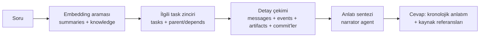

# 06 — Hafıza ve Bağlam

> "Asla unutmama" garantisinin gerçek mimarisi: üç katmanlı hafıza piramidi,
> özetleyici işleyişi, embedding boru hattı, Context Builder ve "nasıl yaptın?" akışı.
> İlgili: [Şema](02-clickhouse-semasi.md) · [Agent Sistemi](03-agent-sistemi.md) ·
> [İletişim Sözleşmesi](13-agent-iletisim-sozlesmesi.md)

## İçindekiler

1. [Problem ve Yaklaşım](#problem-ve-yaklaşım)
2. [Hafıza Piramidi](#hafıza-piramidi)
3. [Özetleyici İşleyişi](#özetleyici-işleyişi)
4. [Embedding Boru Hattı](#embedding-boru-hattı)
5. [Context Builder](#context-builder)
6. [memory_query Aracı](#memory_query-aracı)
7. ["Nasıl Yaptın?" Akışı](#nasıl-yaptın-akışı)

---

## Problem ve Yaklaşım

LLM bağlam pencereleri sınırlıdır; bir projenin ham geçmişi (milyonlarca event
satırı) hiçbir prompta sığmaz. "Agent'lar asla unutmamalı" isteği ancak şu
şekilde gerçek olur: **her şeyi sakla (ucuz), akıllıca geri getir (seçici),
prompta bütçeyle koy (disiplinli)**. ClickHouse üç işte de doğal güçlüdür.

## Hafıza Piramidi

```
        ▲  3. GERİ GETİRME KATMANI
       ╱ ╲    embeddings (vektör arama) + SQL/tam-metin filtreleri
      ╱   ╲   → soruya en alakalı parçaları bulur
     ╱─────╲
    ╱  2. ÖZET KATMANI                                  
   ╱    summaries (görev/faz/gün/konsey özetleri)        
  ╱     file_index (fihrist) · knowledge (kararlar/kısıtlar)
 ╱───────────╲
╱  1. HAM KATMAN                                          
   events + messages + api_usage — append-only, sonsuza dek
```

- **Katman 1** hiç okunmadan yazılır; sorgu ancak iz sürme ("nasıl yaptın",
  hata ayıklama, denetim) gerektiğinde açılır.
- **Katman 2** agent'ların günlük ekmeğidir: prompta giren metinlerin çoğu buradan.
- **Katman 3** doğru Katman-2 (ve gerektiğinde Katman-1) kayıtlarını bulur.

## Özetleyici İşleyişi

`summarizer` rolü (ucuz model) şu tetiklerle çalışır:

| Tetik | Ürettiği |
|---|---|
| Görev `done` | `summaries(scope='task')`: ne istendi, ne yapıldı, hangi dosyalar, hangi kararlar; + dokunulan her dosya için `file_index` güncellemesi (özet, exports, ilişkili ID ekleme) |
| Konsey oturumu kapandı | `summaries(scope='council')`: tartışmanın özü, alınan karar, reddedilen alternatifler ve nedenleri |
| Faz bitti | `summaries(scope='phase')`: alt görev özetlerinin üst özeti |
| Gün sonu (aktif projede) | `summaries(scope='day')`: o günün faaliyet özeti |
| Uzun agent oturumu (bağlam %70 doldu) | `summaries(scope='agent_session')`: oturum içi ara özet — agent kendi geçmişini sıkıştırarak devam eder |

Özet yazımı da normal görevdir (events'e loglanır) ama verifier'sız çalışır
(çift kuralının tek istisnası; düşük risk, yüksek hacim).

## Embedding Boru Hattı

- Arka plan işleyicisi (`memory` paketi) yeni `summaries`, `knowledge`,
  `file_index` ve önemli `messages` (kind: proposal/synthesis/verdict/escalation)
  kayıtlarını kuyruğa alır, parçalara böler (≈800 token, %10 örtüşme),
  `embed()` ile gömer, `embeddings`'e yazar.
- Ham `events` gömülmez (hacim/değer oranı kötü) — onlara SQL ile ulaşılır.
- Arama: `cosineDistance` top-K (varsayılan K=12) + kaynak tablo filtresi;
  sonuçlar tarih ve `status='active'` (knowledge için) ile süzülür.
- Embedding modeli değişimi: [04 — Embedding Sağlayıcısı](04-model-katmani.md#embedding-sağlayıcısı).

## Context Builder

Her LLM çağrısından önce promptun `{{context_pack}}` bölümünü kurar.
Girdi: agent rolü, immutable `TaskBriefV1`, token bütçesi (rol başına ayar; worker
varsayılanı 24k token). Global kaynak seçimleri `baseContextCutoffAt` anına göre
yapılır. Retry/replay daha sonra oluşmuş proje bilgisini göremez; yalnız aynı
task brief'in verifier reddi, gate çıktısı, soru cevabı ve escalation kayıtları
`taskCausalCursor` üzerinden eklenir.

Katmanlı doldurma (öncelik sırasıyla, bütçe dolunca kesilir):

1. **Sabit çekirdek** (her zaman): proje adı/türü, brief'e sabitlenmiş plan özeti,
   cutoff anında geçerli gereksinimler (`knowledge kind='requirement'`),
   brief'te sürüm/hash ile sabitlenmiş kod standartları (`kind='standard'`).
2. **Görev bağlamı**: görev tanımı + kabul kriterleri; `target_files`'ın
   fihrist kayıtları; bağımlı görevlerin (`depends_on`) özetleri;
   üst görev zinciri özeti (delegasyonda).
3. **Semantik komşular**: görev metniyle embedding araması —
   benzer geçmiş görev özetleri, ilgili kararlar ("bunu daha önce nasıl yaptık").
4. **Taze gelişmeler**: projenin son N görev özeti (kronolojik farkındalık).

Kurallar:

- Her parça kaynağıyla etiketlenir (`[knowledge:decision #id]`) — agent
  `memory_query` ile derinleşebilir.
- Kırpma bütünsel yapılır: parça ya tam girer ya hiç girmez (yarım metin yok).
- Kurulan paketin özeti `events`'e yazılır (`decision` olayı: hangi kaynaklar
  girdi/elendi) — bağlam kararları da izlenebilirdir.
- Plan/kural/context değişikliği eski brief'i değiştirmez; yeni brief sürümü ve
  açık bir `rebase` olayı gerektirir.

## memory_query Aracı

Agent'ın eliyle hafıza sorgusu ([05 — Araçlar](05-executor.md#araçlar)):

- Girdi: doğal dil soru + isteğe bağlı kapsam (`decisions`, `files`, `tasks`, `all`).
- İşleyiş: sorunun embedding'i → top-K arama → bulunan özet/karar/fihrist
  kayıtları + gerekiyorsa bağlı görevlerin `result_summary`'leri derlenip
  kompakt cevap döner.
- Amaç: Context Builder'ın öngöremediği ihtiyaçları agent'ın kendisinin
  kapatabilmesi ("bu projede tarih formatı kararı neydi?").

## "Nasıl Yaptın?" Akışı

Kullanıcı (veya bir agent) "X'i nasıl yaptın?" diye sorduğunda `narrator` rolü:



1. Soru gömülür, ilgili görev(ler) bulunur ([Şema → örnek sorgular](02-clickhouse-semasi.md#örnek-sorgular)).
2. Görev zincirinin `messages` + `events` + `artifacts` kayıtları kronolojik çekilir.
3. Narrator bunlardan anlatı kurar: *kim, neyi, neden, hangi sırayla, hangi
   kararlarla; hangi commit'ler*. Cevap referanslıdır (task/commit/karar ID'leri).
4. Aynı akış **iş devrinde** kullanılır: "geçen ay X'i yapan işleyişi çek, bu yeni
   görevi yapacak agent'a bağlam olarak ver" — kullanıcının istediği
   "o konuyla ilgili tüm işleyişi DB'den çekip yeni agent'a verme" senaryosu
   budur: narrator çıktısı yeni görevin Context Builder paketine 3. katman
   olarak enjekte edilir.
